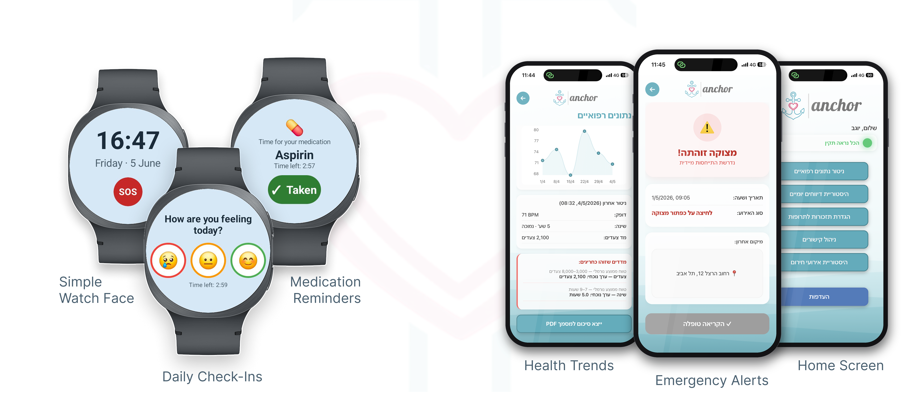

  

  <b>A simple smartwatch and family dashboard that support independent living 
  through daily check-ins, reminders, health trends, and timely alerts.</b>

  Wear OS watch app · iOS/Android smartphone app · AWS serverless backend

---

## Overview

Families with a senior living independently often lack real visibility into how they're doing day to day, and only find out about a problem after it happens. Anchor closes that gap: a smartwatch worn by the senior logs daily check-ins, tracks medication adherence, and monitors basic vitals, while a mobile dashboard turns that data into a simple status their family can trust - with instant alerts for emergencies and falls.

## Key features

**Watch (senior)**
- Daily mood check-in and medication/water reminders, scheduled locally so they still work offline
- One-tap SOS and automatic fall detection
- Continuous heart-rate and step tracking
- Fully localized in Hebrew and English

**Dashboard (family)**
- One-glance Green/Yellow/Red wellness status, with the reason always visible
- Health history with trend charts and PDF export
- Emergency alerts and daily check-in reports
- Remote reminder management and QR-based watch pairing

  

## Tech stack

| Layer | Technology |
|---|---|
| **Watch app** | Kotlin, Wear OS, Room, Firebase Cloud Messaging |
| **Dashboard app** | React Native (Expo), AWS Amplify, Node.js |
| **Backend** | AWS Lambda (Node.js), API Gateway, DynamoDB, Cognito, SNS/FCM |
| **AI** | OpenAI API, used for senior wellness classification |

## Team

*Built by Omri Shtruzer & Daniel Hershco as a final project at The Academic College of Tel Aviv-Yafo, 2026.*
